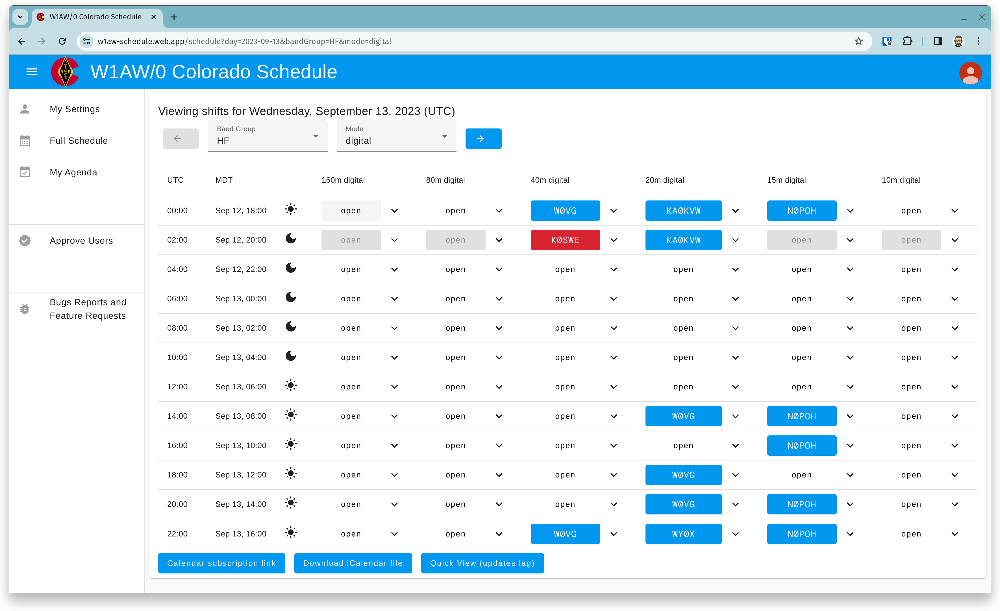

#  W1AW/0 Colorado Scheduler

During the weeks of May 27th through June 2nd and September 2nd through 8th, 2026, the Colorado section of the ARRL is going to be operating as W1AW/0 as part of the ARRL's America250 Worked All States award program! We need a way of scheduling operators to cover shifts.



## Development server

Run `ng serve` for a dev server. Navigate to `http://localhost:4200/`. The application will
automatically reload if you change any of the source files.

## Firebase

This project uses several Firebase products (free tier) to handle functionality. It uses Firebase
Authentication, Firestore and the Firebase extension firebase/firestore-send-email. (I happened to
use SendGrid as an SMTP provider, also free tier). Those wishing to run their own instance and/or
develop new features will need to configure their own Firebase project, SMTP providers, and API
keys.

### Discord OAuth Configuration

To enable Discord account linking, you need to configure Discord OAuth credentials:

1. Create a Discord application at https://discord.com/developers/applications
2. Add a redirect URI: `https://us-central1-YOUR_PROJECT_ID.cloudfunctions.net/discordOAuthCallback`
3. Set the following Firebase environment variables:
   ```bash
   firebase functions:config:set discord.client_id="YOUR_DISCORD_CLIENT_ID"
   firebase functions:config:set discord.client_secret="YOUR_DISCORD_CLIENT_SECRET"
   firebase functions:config:set discord.redirect_uri="https://us-central1-YOUR_PROJECT_ID.cloudfunctions.net/discordOAuthCallback"
   ```
4. Deploy the functions: `npm run deploy --prefix functions`

For local development, download the config:

```bash
firebase functions:config:get > functions/.runtimeconfig.json
```

## Deployment

The application is automatically deployed to Firebase Hosting using GitHub Actions with Workload
Identity Federation for secure, keyless authentication. See [DEPLOYMENT.md](DEPLOYMENT.md) for
detailed setup instructions.
